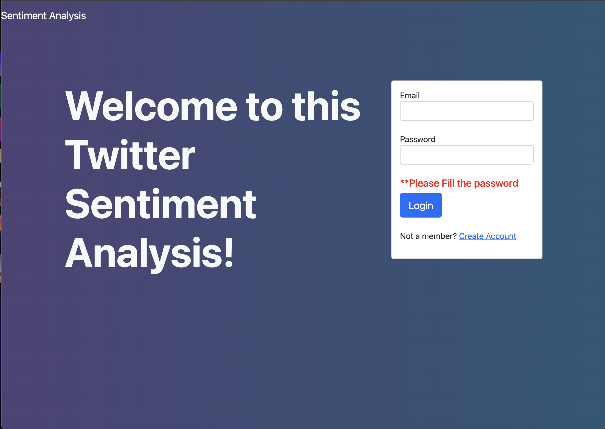
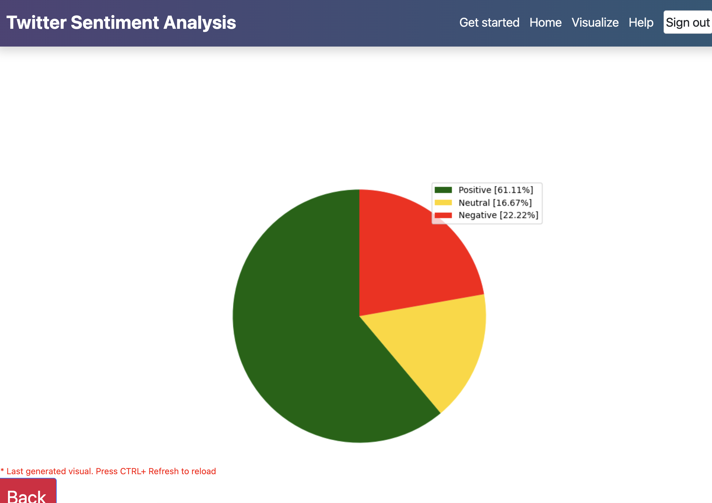

# Twitter Sentiment Analysis Flask WebApp

This is a webapp made using Python and Flask. It has a registration system and a dashboard. Users can retrieve twitter text based on a keyword to analyse its sentiments/customer feelings. This data can also be visualised.
Due to Twitter API changes this app uses a library calls twikit to scrape data. 

## Purpose

- To segregate user sentiment on a scale of -1.0 to 1.0 with -1.0 being negative and 1.0 being positive
- To collect and visualise data clearly
- Help users analyse a large amount of data quickly

## Requirements

- Python
- Flask
- twikit
- ApacheSQL hosted through Xampp
- Bootstrap
- JQuery
- HTML/CSS

## Implement

1. Download and install Xampp Server
2. Start Apache Xampp and MySQL - Create a database with 3 columns. (username, email, password)
3. Clone repo or implement yourself - Dont forget to fill out twitter credentials!

## Screenshots of use:

Initial login screen with option to register user that works. Screenshot not included

Dashboard after loging in

Analysis page which takes keyword and number of tweets to analyse. (For now limited to 20 due to library restrictions)

Numbers from analysis with option to see a visualisation

Data visualisation pie chart